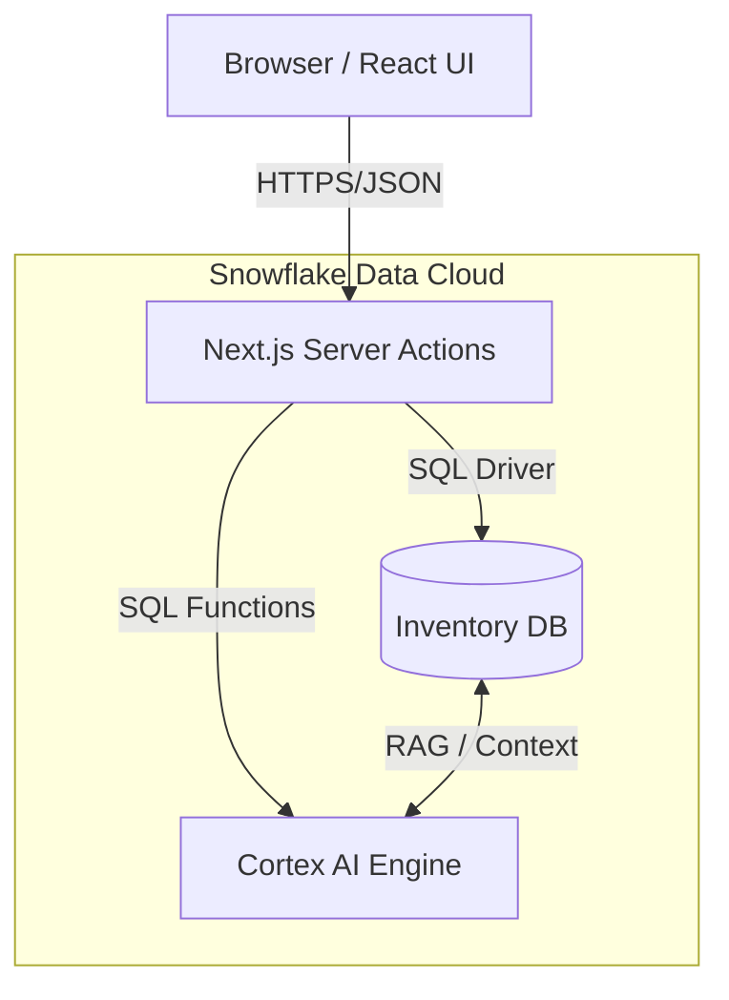

# 🏗️ Architecture & Tech Stack

## 📐 System Architecture

StockHealth AI utilizes a **Hybrid Serverless Architecture**, leveraging Next.js for the frontend/API layer and Snowflake for the heavy-lifting data reliability and AI compute.

### High-Level Data Flow

1.  **User Interaction**: The user interacts with the UI (Dashboard, Inventory Table, Chat).
2.  **Request Handling**: Next.js App Router API endpoints (`app/api/*`) and Server Actions (`app/actions/*`) receive requests.
3.  **Data Processing**:
    *   **CRUD Operations**: `snowflake-sdk` connects to the Snowflake Data Cloud to Read/Write inventory items.
    *   **AI Inference**: Prompts are sent to `SNOWFLAKE.CORTEX.COMPLETE` function. Snowflake's internal LLMs process the data and return text/JSON.
4.  **Response**: Processed data is sent back to the client, triggering UI updates via React state.



---

## 🛠️ Technology Stack

### Core Framework
| Component | Technology | Version | Description |
| :--- | :--- | :--- | :--- |
| **Framework** | **Next.js** | **16.0** | (Turbopack) High-performance React framework with Server Components and Server Actions. |
| **Language** | **TypeScript** | **5.x** | Strongly typed JavaScript ensuring reliable data models and interface contracts. |
| **Runtime** | **Node.js** | **20+** | Server-side runtime environment for Next.js actions. |

### Frontend & UI
| Component | Technology | Description |
| :--- | :--- | :--- |
| **UI Engine** | **React** | **19.x** | The library for web and native user interfaces. |
| **Styling** | **Tailwind CSS** | **4.x** | Utility-first CSS framework for rapid, responsive design system implementation. |
| **Animations** | **Framer Motion** | Declarative animations for smooth page transitions and micro-interactions. |
| **Icons** | **Lucide React** | Consistent, lightweight SVG icons. |
| **Charts** | **Recharts** & **Chart.js** | Composable charting libraries for data visualization (Sales trends, Stock levels). |
| **Themes** | **next-themes** | Robust dark mode/light mode switching support. |
| **Markdown** | **react-markdown** | Rendering AI-generated responses and documentation safely. |

### Backend & Data
| Component | Technology | Description |
| :--- | :--- | :--- |
| **Database** | **Snowflake** | Cloud Data Platform. Stores all Inventory, Transaction, and User Activity data. |
| **Driver** | **snowflake-sdk** | Official Node.js driver for connecting Next.js to Snowflake. |
| **Validation** | **Zod** | Schema validation for forms and API data inputs. |
| **AI Engine** | **Snowflake Cortex** | Integrated Serverless AI service access via SQL (`SNOWFLAKE.CORTEX.COMPLETE`). |

### Utilities
| Component | Technology | Description |
| :--- | :--- | :--- |
| **PDF Generation** | **jspdf** & **autotable** | Generating downloadable invoice PDFs client-side. |
| **CSV/Excel** | **papaparse** & **xlsx** | Parsing and exporting data for reports. |
| **Class Utils** | **clsx** & **tailwind-merge** | conditionally merging Tailwind class names. |
| **Date Time** | **Native Date** | Handling ISO strings for database timestamps. |

---

## 🤖 AI Integration Details

The project relies heavily on **Snowflake Cortex** for intelligence.

*   **Model**: `llama3-70b` (accessible via Cortex).
*   **Integration**: Direct SQL calls from the backend Service layer.
*   **Context**: Data is retrieved from Snowflake tables (`ITEMS`, `ACTIVITIES`) and formatted into a text prompt before being sent to the LLM.

---

## 📂 Project Structure

```bash
📦 snowflake-inventory
├── 📂 app                 # Next.js App Router
│   ├── 📂 api             # API Routes (Search, etc.)
│   ├── 📂 actions         # Server Actions (Inventory CRUD, AI Chat)
│   ├── 📂 dashboard       # Main Application Views
│   ├── 📂 reports         # Reporting & Analytics Views
│   ├── 📂 styles          # Global Styles
│   └── page.tsx           # Landing/Login Page
├── 📂 components          # Reusable UI Components
│   ├── StoreSelector.tsx  # Role-based store switcher
│   ├── GlobalSearch.tsx   # Omni-search bar
│   └── ...
├── 📂 lib                 # Shared Utilities
│   ├── snowflakeService.ts # Main Snowflake Service Class (Singleton)
│   ├── auth.ts            # Simulated Auth & Roles
│   ├── aiContext.ts       # AI Prompt Engineering & Context Builders
│   └── exportUtils.ts     # Helpers for PDF/CSV Data export
├── 📂 documentation       # Project Documentation
└── .env.local             # Environment Secrets (Credentials)
```
