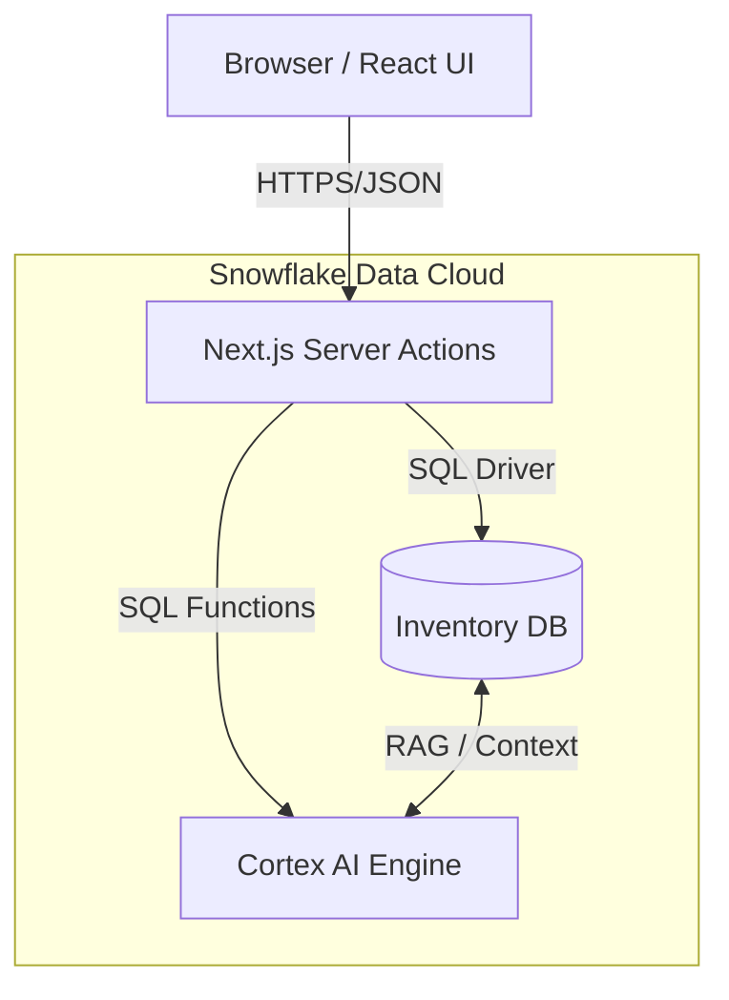

# 🏗️ Architecture & Tech Stack

## 📐 System Architecture

StockHealth AI utilizes a **Hybrid Serverless Architecture**, leveraging Next.js for the frontend/API layer and Snowflake for the heavy-lifting data reliability and AI compute.

### High-Level Data Flow

1.  **User Interaction**: The user interacts with the UI (Dashboard, Inventory Table, Chat).
2.  **Request Handling**: Next.js App Router API endpoints (`app/api/*`) and Server Actions (`app/actions/*`) receive requests.
3.  **Data Processing**:
    *   **CRUD Operations**: `snowflake-sdk` connects to the Snowflake Data Cloud to Read/Write inventory items.
    *   **AI Inference**: Prompts are sent to `SNOWFLAKE.CORTEX.COMPLETE` function. Snowflake's internal LLMs process the data and return text/JSON.
4.  **Response**: Processed data is sent back to the client, triggering UI updates via React state.



---

## 🛠️ Technology Stack

### Frontend
| Component | Technology | Reasoning |
| :--- | :--- | :--- |
| **Framework** | **Next.js 14** | Best-in-class performance, Server Components, and API routes. |
| **Language** | **TypeScript** | Type safety ensures standardized data models (Inventory, User). |
| **Styling** | **Tailwind CSS 4** | Rapid UI development with a modern, utility-first approach. |
| **State** | **React Hooks** | `useState`, `useEffect` for local responsiveness. |
| **Icons** | **Lucide & Material** | Modern, clean iconography for a professional look. |

### Backend & Database
| Component | Technology | Reasoning |
| :--- | :--- | :--- |
| **Runtime** | **Node.js** | Seamless integration with Next.js backend. |
| **Database** | **Snowflake** | Scalable, secure data warehousing. Handles massive inventory lists effortlessly. |
| **Driver** | **snowflake-sdk** | Official Node.js driver for high-performance connectivity. |

### Artificial Intelligence
| Component | Technology | Reasoning |
| :--- | :--- | :--- |
| **Reasoning Engine** | **Snowflake Cortex** | Serverless AI. No external API keys (like OpenAI) required. Data never leaves the Snowflake environment. |
| **Model** | **Llama 3 (70B)** | High intelligence, excellent for complex SQL generation and reasoning. |
| **Mode** | **JSON Mode** | We force the AI to verify structured JSON for predictable app behavior. |

---

## 📂 Project Structure

```bash
📦 snowflake-inventory
├── 📂 app                 # Next.js App Router
│   ├── 📂 api             # API Routes (GET/POST endpoints)
│   ├── 📂 dashboard       # Main Application Views (Inventory, Settings)
│   ├── 📂 actions         # Server Actions (Chat, AI logic)
│   └── page.tsx           # Login Page
├── 📂 lib                 # Shared Utilities
│   ├── auth.ts            # User & Role Definitions
│   ├── snowflake.ts       # DB Connection Logic
│   └── aiContext.ts       # Context Generators for AI
├── 📂 scripts             # Database Scripts
│   ├── create-tables.sql  # Schema Definition
│   └── seed-data.ts       # Inventory Seeding Logic
├── 📂 documentation       # YOU ARE HERE
└── .env.local             # Environment Secrets
```
