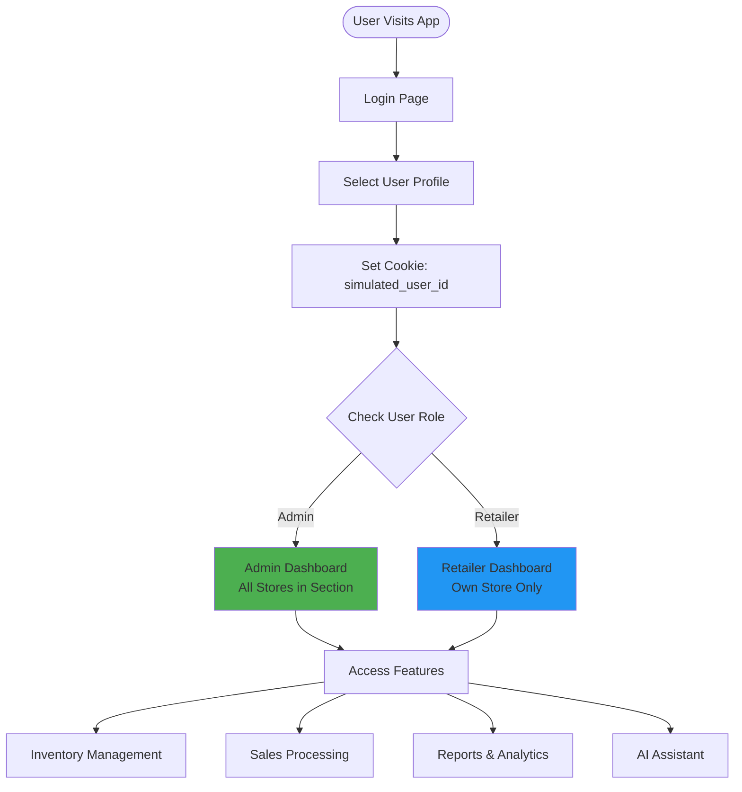
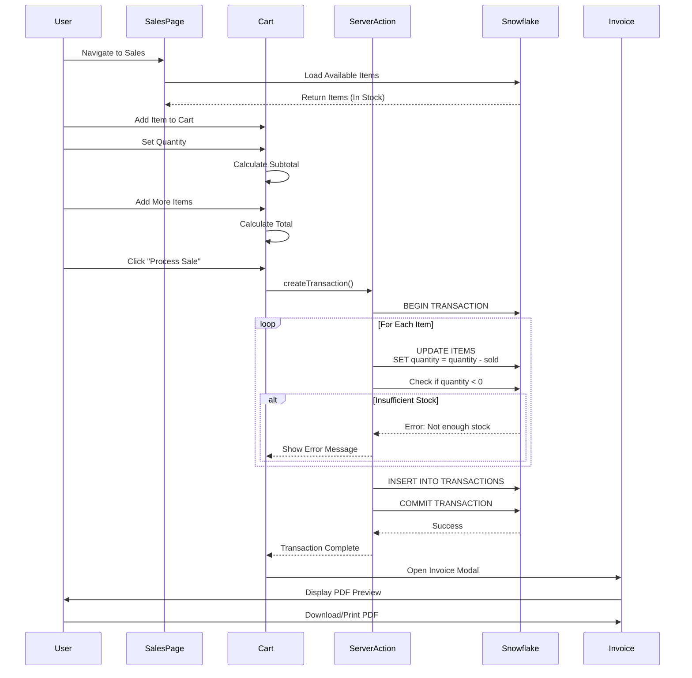
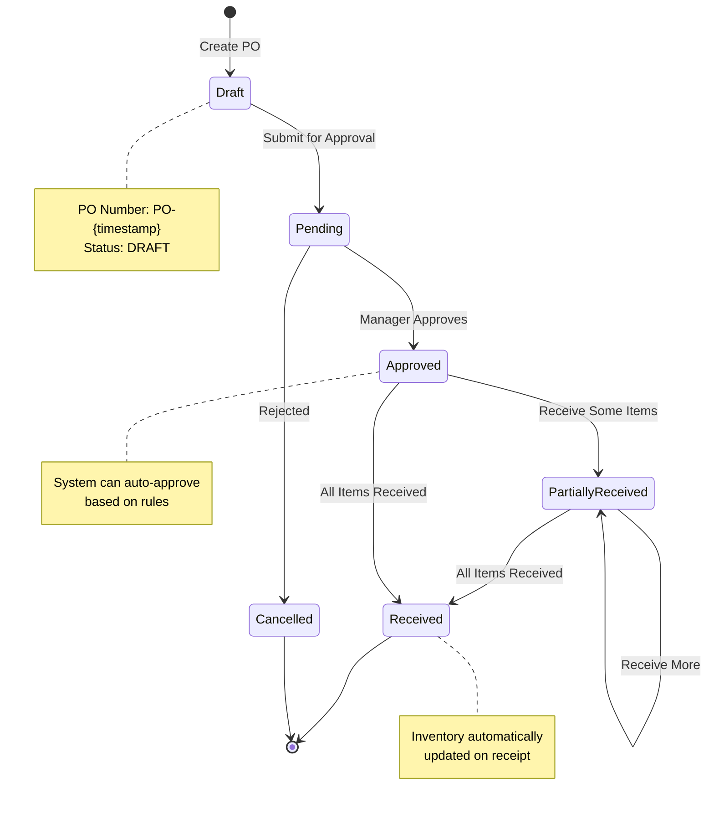
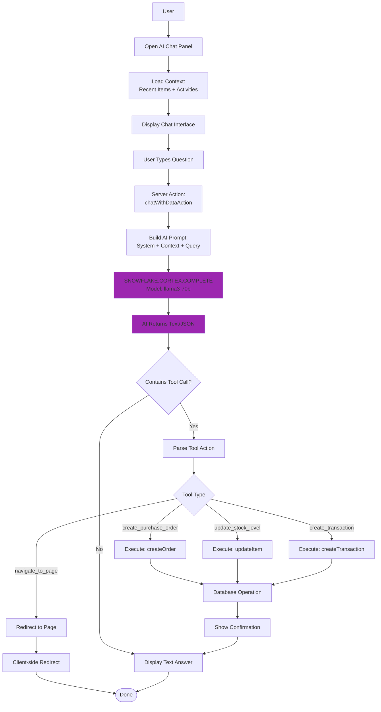
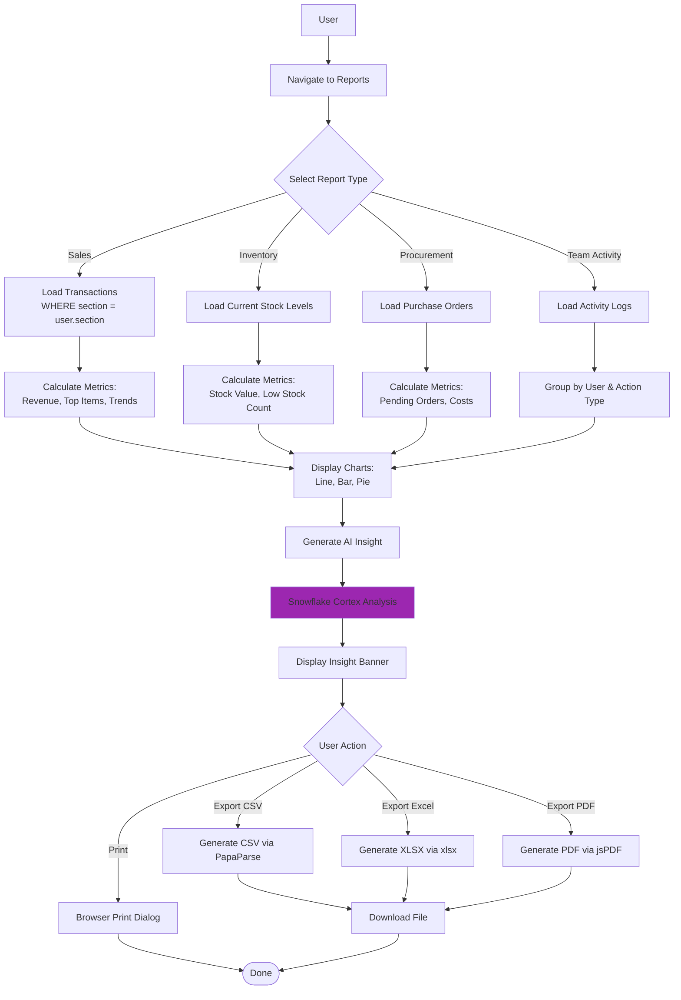
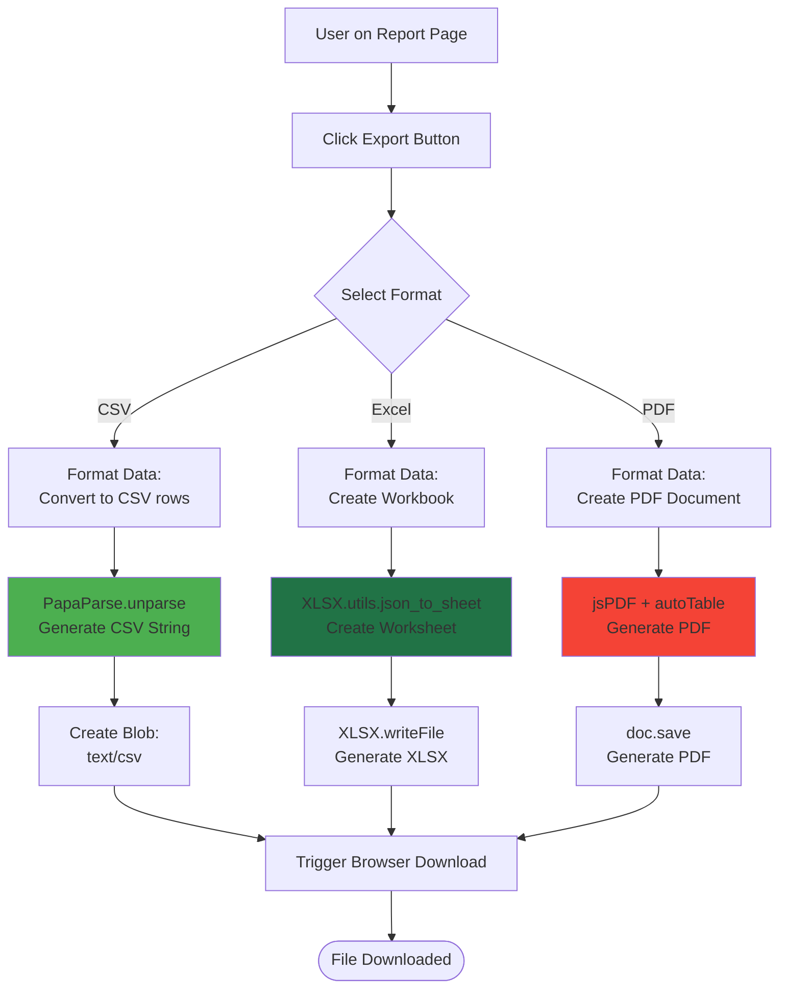

# 🔄 Process Flows & Use Cases

This document provides detailed process flows and use case diagrams for the **StockHealth AI** inventory management system.

---

## 📋 Table of Contents

1. [User Authentication & Role-Based Access](#1-user-authentication--role-based-access)
2. [Inventory Management Flow](#2-inventory-management-flow)
3. [Sales & Transaction Processing](#3-sales--transaction-processing)
4. [Procurement & Purchase Order Flow](#4-procurement--purchase-order-flow)
5. [AI-Powered Insights](#5-ai-powered-insights)
6. [Reporting & Analytics](#6-reporting--analytics)
7. [Data Export & Sharing](#7-data-export--sharing)

---

## 1. User Authentication & Role-Based Access

### Use Case Description
The system supports role-based access control (RBAC) with three distinct user types across three organizational sections (FDC, Hospital, NGO).

### User Roles
- **Admin**: Full visibility and control over their entire section
- **Retailer**: Limited to their specific store's inventory

### Process Flow



### Detailed Steps

1. **Login**: User selects their profile from the login screen
2. **Cookie Creation**: System stores `simulated_user_id` in browser cookies
3. **Role Detection**: Server Actions read the cookie to determine user role and section
4. **Data Filtering**: 
   - **Admins**: See all items where `item.section === user.section`
   - **Retailers**: See only items where `item.ownerId === user.id`

---

## 2. Inventory Management Flow

### Use Case Description
Users can view, add, edit, and delete inventory items. The system automatically tracks changes and logs activities.

### CRUD Operations Flow

```mermaid
graph TD
    User[User] --> ViewInv[View Inventory Page]
    ViewInv --> ChunkedLoad[Chunked Data Loading<br/>50 items per batch]
    ChunkedLoad --> Display[Display Items in Table]
    
    Display --> Actions{User Action}
    
    Actions -->|Add New| AddForm[Fill Add Item Form]
    Actions -->|Edit| EditForm[Fill Edit Form]
    Actions -->|Delete| ConfirmDel[Confirm Deletion]
    Actions -->|Search| GlobalSearch[Global Search]
    
    AddForm --> ValidateAdd[Validate Data<br/>Zod Schema]
    EditForm --> ValidateEdit[Validate Data]
    
    ValidateAdd --> ServerActionAdd[Server Action:<br/>addItem]
    ValidateEdit --> ServerActionEdit[Server Action:<br/>updateItem]
    ConfirmDel --> ServerActionDel[Server Action:<br/>deleteItem]
    
    ServerActionAdd --> SnowflakeInsert[INSERT INTO ITEMS]
    ServerActionEdit --> SnowflakeUpdate[UPDATE ITEMS]
    ServerActionDel --> SnowflakeDelete[DELETE FROM ITEMS]
    
    SnowflakeInsert --> LogActivity[Log Activity]
    SnowflakeUpdate --> LogActivity
    SnowflakeDelete --> LogActivity
    
    LogActivity --> RefreshUI[Refresh UI State]
    GlobalSearch --> SearchAPI[/api/search Endpoint]
    SearchAPI --> SnowflakeQuery[Query Snowflake:<br/>LIKE search]
    SnowflakeQuery --> SearchResults[Display Results]
    
    style ServerActionAdd fill:#4CAF50
    style ServerActionEdit fill:#FF9800
    style ServerActionDel fill:#F44336
```

### Detailed Steps

#### Adding New Inventory Item
1. **User Input**: User navigates to "Add Item" form
2. **Form Validation**: Client-side validation using Zod schema
3. **Server Action**: `addItem()` server action is triggered
4. **Database Insert**: 
   ```sql
   INSERT INTO ITEMS (ID, NAME, CATEGORY, QUANTITY, PRICE, SECTION, OWNER_ID, ...)
   VALUES (?, ?, ?, ?, ?, ?, ?, ...)
   ```
5. **Activity Logging**: System logs "added stock" activity
6. **UI Update**: React state refreshes to show new item

#### Editing Inventory Item
1. **Item Selection**: User clicks edit icon on inventory row
2. **Pre-fill Form**: Current item data loads into edit modal
3. **Modification**: User updates quantity, price, or other fields
4. **Server Action**: `updateItem(id, updates, section)` is called
5. **Database Update**:
   ```sql
   UPDATE ITEMS 
   SET QUANTITY = ?, PRICE = ?, LAST_UPDATED = ?
   WHERE ID = ? AND SECTION = ?
   ```
6. **Activity Logging**: System logs "updated item" activity

#### Stock Status Calculation
The system automatically determines stock status:
- **Out of Stock**: `quantity === 0`
- **Low Stock**: `quantity <= minQuantity` or `quantity <= 50`
- **In Stock**: `quantity > 50`

---

## 3. Sales & Transaction Processing

### Use Case Description
Process sales transactions, deduct inventory, generate invoices, and maintain transaction history.

### Sales Flow Diagram



### Detailed Steps

1. **Item Selection**: User browses available inventory in their section
2. **Cart Management**: 
   - Add items to shopping cart
   - Adjust quantities
   - Real-time total calculation
3. **Transaction Validation**:
   - Check stock availability: `if (item.quantity < requestedQty) → Error`
   - Validate payment method
   - Generate unique invoice number: `INV-{timestamp}`
4. **Database Operations**:
   ```sql
   -- Atomic transaction
   BEGIN;
   
   -- Deduct inventory
   UPDATE ITEMS 
   SET QUANTITY = QUANTITY - ? 
   WHERE ID = ? AND SECTION = ?;
   
   -- Record transaction
   INSERT INTO TRANSACTIONS (
       ID, INVOICE_NUMBER, DATE, TYPE, ITEMS, 
       TOTAL_AMOUNT, PAYMENT_METHOD, SECTION, PERFORMED_BY
   ) VALUES (?, ?, ?, 'SALE', ?, ?, ?, ?, ?);
   
   COMMIT;
   ```
5. **Invoice Generation**:
   - Generate PDF using jsPDF
   - Include itemized list with prices
   - Display in modal for download/print

---

## 4. Procurement & Purchase Order Flow

### Use Case Description
Create purchase orders for low-stock items, track approval status, and receive goods into inventory.

### Purchase Order Lifecycle



### Process Flow

```mermaid
graph TD
    Start([Low Stock Alert]) --> ReorderPage[Navigate to Reorder Page]
    ReorderPage --> LoadLowStock[Load Items: quantity <= minQuantity]
    LoadLowStock --> DisplayItems[Display Low Stock Items]
    
    DisplayItems --> SelectItems[Select Items to Order]
    SelectItems --> SetQuantity[Set Order Quantities]
    SetQuantity --> SetVendor[Select/Enter Vendor]
    
    SetVendor --> CreatePO[Click 'Create Purchase Order']
    CreatePO --> ServerAction[Server Action:<br/>createOrder]
    
    ServerAction --> GeneratePO[Generate PO Number<br/>PO-{timestamp}]
    GeneratePO --> InsertDB[INSERT INTO PURCHASE_ORDERS]
    InsertDB --> SetStatusPending[Status: PENDING]
    
    SetStatusPending --> NotifyAdmin[Notify Admin]
    NotifyAdmin --> AdminReview{Admin Review}
    
    AdminReview -->|Approve| UpdateApproved[Status: APPROVED]
    AdminReview -->|Reject| UpdateCancelled[Status: CANCELLED]
    
    UpdateApproved --> VendorFulfills[Vendor Fulfills Order]
    VendorFulfills --> ReceiveGoods[Receive Goods]
    
    ReceiveGoods --> UpdatePartial{All Items?}
    UpdatePartial -->|Partial| StatusPartial[Status: PARTIALLY_RECEIVED]
    UpdatePartial -->|Complete| StatusReceived[Status: RECEIVED]
    
    StatusPartial --> UpdateInventoryPartial[UPDATE ITEMS<br/>quantity += received]
    StatusReceived --> UpdateInventoryFull[UPDATE ITEMS<br/>quantity += ordered]
    
    UpdateInventoryPartial --> End([Done])
    UpdateInventoryFull --> End
    UpdateCancelled --> End
    
    style UpdateApproved fill:#4CAF50
    style UpdateCancelled fill:#F44336
    style StatusReceived fill:#4CAF50
```

### Detailed Steps

1. **Identify Low Stock**: System flags items where `quantity <= minQuantity`
2. **Create PO**:
   - Select items to reorder
   - Set requested quantities
   - Choose vendor from dropdown or add new
   - Add notes (optional)
3. **Approval Workflow**:
   - **Auto-approval**: If user is Admin
   - **Manual approval**: If retailer creates PO
4. **Receiving Process**:
   - Mark items as received (partial or full)
   - System automatically adds quantity to inventory
   - Update PO status to RECEIVED
5. **Inventory Update**:
   ```sql
   UPDATE ITEMS 
   SET QUANTITY = QUANTITY + ? 
   WHERE ID = ?;
   
   UPDATE PURCHASE_ORDERS 
   SET STATUS = 'RECEIVED', RECEIVED_DATE = ? 
   WHERE ID = ?;
   ```

---

## 5. AI-Powered Insights

### Use Case Description
AI assistant provides real-time insights, answers questions, and can execute actions like creating purchase orders or updating stock levels.

### AI Interaction Flow



### AI Context Building

The system constructs a rich context for the AI:

```javascript
// Pseudo-code for context generation
function getInventoryContext(items, activities) {
    // Analyze stock levels
    const criticalItems = items.filter(i => i.quantity <= 10);
    const lowItems = items.filter(i => i.quantity <= 50);
    
    // Check expiry dates
    const expiringItems = items.filter(i => {
        const daysToExpiry = getDaysUntilExpiry(i.expiryDate);
        return daysToExpiry > 0 && daysToExpiry <= 30;
    });
    
    // Build alerts
    const alerts = [
        ...criticalItems.map(i => `[CRITICAL] ${i.name}: Only ${i.quantity} left`),
        ...expiringItems.map(i => `[EXPIRING] ${i.name}: Expires in ${days} days`)
    ];
    
    // Format context
    return `
        === ALERTS ===
        ${alerts.join('\n')}
        
        === INVENTORY ===
        ${items.map(formatItem).join('\n')}
        
        === RECENT ACTIVITIES ===
        ${activities.map(formatActivity).join('\n')}
    `;
}
```

### Available AI Tools

1. **create_purchase_order**: Creates PO for specified item and quantity
2. **update_stock_level**: Directly updates item quantity
3. **create_transaction**: Processes sales or internal usage
4. **navigate_to_page**: Redirects user to reports or specific pages

---

## 6. Reporting & Analytics

### Use Case Description
Generate comprehensive reports on sales, inventory, procurement, and team activity with AI-powered insights.

### Report Generation Flow



### Key Metrics Calculated

#### Sales Report
- **Total Revenue**: `SUM(totalAmount)`
- **Transaction Count**: `COUNT(*)`
- **Average Order Value**: `AVG(totalAmount)`
- **Top Selling Items**: Group by item name, order by quantity sold
- **Sales Trend**: Daily/Weekly/Monthly aggregation

#### Inventory Report
- **Total Stock Value**: `SUM(quantity * price)`
- **Items Count**: `COUNT(DISTINCT id)`
- **Low Stock Items**: `COUNT(WHERE quantity <= minQuantity)`
- **Categories Distribution**: Group by category
- **Expiring Soon**: Items expiring within 30 days

#### Procurement Report
- **Pending Orders**: `COUNT(WHERE status IN ('PENDING', 'APPROVED'))`
- **Total Estimated Cost**: `SUM(totalEstimatedCost WHERE status != 'CANCELLED')`
- **Vendor Analysis**: Group by vendor

---

## 7. Data Export & Sharing

### Use Case Description
Export data in multiple formats for external analysis, reporting, or backup purposes.

### Export Process Flow



### Export Formats

#### CSV Export
- **Use Case**: Import into Excel, Google Sheets, or other analytics tools
- **Library**: PapaParse
- **Features**: 
  - Automatic column headers
  - UTF-8 encoding support
  - Large dataset handling

#### Excel Export
- **Use Case**: Professional reports for management
- **Library**: SheetJS (xlsx)
- **Features**:
  - Multiple sheets support
  - Auto-column sizing
  - Formula support
  - Styling capabilities

#### PDF Export
- **Use Case**: Print-ready reports and invoices
- **Library**: jsPDF + autotable
- **Features**:
  - Custom headers and footers
  - Logo integration
  - Table formatting
  - Page numbering

---

## 🔐 Security Considerations

### Data Access Control
- All database queries include `WHERE section = ?` clause to enforce section isolation
- Retailers can only access data where `ownerId = user.id`
- Server Actions validate user permissions before database operations

### SQL Injection Prevention
- All queries use parameterized statements
- No dynamic SQL string concatenation
- Snowflake driver handles escaping automatically

### Input Validation
- Zod schemas validate all form inputs
- Type checking via TypeScript
- Client and server-side validation

---

## 📊 Performance Optimizations

### Chunked Data Loading
- Load data in 50-item batches to prevent UI freeze
- Progressive rendering improves perceived performance
- Infinite scroll pattern for large datasets

### Server Components
- Data fetching happens on the server
- Reduced client-side JavaScript bundle
- Faster initial page loads

### Caching Strategy
- Activity logs cached for 5 minutes
- Static routes pre-rendered at build time
- Dynamic routes use ISR (Incremental Static Regeneration)

---

## 🎯 Summary

This document outlined the core process flows and use cases for the StockHealth AI system:

1. **Authentication**: Role-based access with Admin/Retailer separation
2. **Inventory Management**: Full CRUD with automatic status tracking
3. **Sales Processing**: Cart-based transactions with invoice generation
4. **Procurement**: Complete PO lifecycle from creation to receipt
5. **AI Insights**: Context-aware assistant with action execution
6. **Reporting**: Multi-format exports with AI-powered analysis
7. **Data Export**: CSV/Excel/PDF generation for external use

Each flow is designed with security, performance, and user experience as top priorities.
