# 🏛️ System Architecture Documentation

This document provides a comprehensive technical overview of the **StockHealth AI** architecture, including system design, component interactions, data flows, and deployment strategies.

---

## 📋 Table of Contents

1. [Architecture Overview](#1-architecture-overview)
2. [Layered Architecture](#2-layered-architecture)
3. [Component Architecture](#3-component-architecture)
4. [Data Architecture](#4-data-architecture)
5. [Integration Architecture](#5-integration-architecture)
6. [Deployment Architecture](#6-deployment-architecture)
7. [Security Architecture](#7-security-architecture)
8. [Scalability & Performance](#8-scalability--performance)

---

## 1. Architecture Overview

### 1.1 High-Level System Architecture

StockHealth AI follows a **modern serverless architecture** with clear separation of concerns, leveraging Next.js for the application layer and Snowflake for data and AI processing.


### 1.2 Architecture Principles

| Principle | Implementation |
|-----------|---------------|
| **Separation of Concerns** | Clear boundaries between UI, Business Logic, and Data layers |
| **Single Responsibility** | Each component/service has one well-defined purpose |
| **DRY (Don't Repeat Yourself)** | Shared interfaces, reusable components, centralized services |
| **Scalability First** | Serverless architecture with auto-scaling capabilities |
| **Security by Design** | Role-based access, parameterized queries, environment-based secrets |
| **Performance Optimized** | Server Components, Edge CDN, chunked data loading |

---

## 2. Layered Architecture

### 2.1 Architecture Layers

The system follows a clean **four-tier architecture**:


### 2.2 Layer Responsibilities

#### Presentation Layer
- **Purpose**: User interface and interaction
- **Technologies**: React 19, Tailwind CSS, Framer Motion
- **Components**:
  - Page layouts (`app/*/page.tsx`)
  - Reusable UI components (`components/*`)
  - Client-side state management (React hooks)
  - Form validation (Zod schemas)

#### Application Layer
- **Purpose**: Request handling and routing
- **Technologies**: Next.js 16 App Router
- **Components**:
  - API endpoints (`app/api/*`)
  - Server Actions (`app/actions/*`)
  - Route handlers
  - Cookie-based authentication

#### Business Logic Layer
- **Purpose**: Core application logic and rules
- **Technologies**: TypeScript, Node.js
- **Components**:
  - `SnowflakeInventoryService`: Database operations
  - `AIService`: Cortex AI integration
  - Domain calculators (stock status, expiry checks)
  - Export utilities (PDF/CSV/Excel generation)

#### Data Layer
- **Purpose**: Data persistence and retrieval
- **Technologies**: Snowflake, SQL
- **Components**:
  - Database schema (tables, indexes)
  - SQL query execution
  - Data models (TypeScript interfaces)
  - Connection management

---

## 3. Component Architecture

### 3.1 Frontend Component Hierarchy


### 3.2 Backend Service Architecture


### 3.3 Service Design Patterns

#### Singleton Pattern (Service Classes)
```typescript
// Ensures single instance across application
export class SnowflakeInventoryService {
    private connection: snowflake.Connection | null = null;
    private connectionPromise: Promise<void> | null = null;
    
    constructor() {
        if (this.hasCredentials()) {
            this.connectionPromise = this.connect();
        }
    }
}

export const snowflakeService = new SnowflakeInventoryService();
```

#### Repository Pattern (Data Access)
```typescript
// Encapsulates data access logic
async getAllItems(section: string): Promise<StockItem[]> {
    const query = 'SELECT * FROM ITEMS WHERE SECTION = ?';
    return await this.executeQuery<StockItem>(query, [section]);
}
```

#### Factory Pattern (Query Building)
```typescript
// Dynamically constructs queries based on input
private buildUpdateQuery(updates: Partial<StockItem>): string {
    const fields = Object.keys(updates);
    const setClause = fields.map(f => `${toSnakeCase(f)} = ?`).join(', ');
    return `UPDATE ITEMS SET ${setClause}, LAST_UPDATED = ? WHERE ID = ?`;
}
```

---

## 4. Data Architecture

### 4.1 Database Schema (Entity-Relationship Diagram)


### 4.2 Data Flow Architecture


### 4.3 Data Consistency & Integrity

#### Transaction Management
```sql
-- Example: Atomic transaction for sales processing
BEGIN TRANSACTION;

-- Step 1: Deduct inventory
UPDATE ITEMS 
SET QUANTITY = QUANTITY - :sold_quantity 
WHERE ID = :item_id AND QUANTITY >= :sold_quantity;

-- Step 2: Record transaction
INSERT INTO TRANSACTIONS (ID, INVOICE_NUMBER, ...) 
VALUES (:id, :invoice_num, ...);

-- Step 3: Log activity
INSERT INTO ACTIVITIES (ID, USER, ACTION, TARGET, TIME, TYPE, SECTION)
VALUES (:id, :user, 'processed sale', :item_name, CURRENT_TIMESTAMP(), 'create', :section);

COMMIT;
```

#### Referential Integrity
- **OWNER_ID** in ITEMS references STORES.ID (implicit)
- **PERFORMED_BY** in TRANSACTIONS references USERS.ID (implicit)
- **SECTION** field ensures data isolation between departments

#### Data Validation Layers
1. **Frontend**: Zod schema validation before submission
2. **Backend**: TypeScript type checking + runtime validation
3. **Database**: Snowflake constraints (NOT NULL, data types)

---

## 5. Integration Architecture

### 5.1 External Integration Points


### 5.2 API Integration Flow

```mermaid
sequenceDiagram
    participant Client as Browser
    participant NextJS as Next.js Server
    participant Service as Service Layer
    participant Snowflake as Snowflake DB
    participant Cortex as Cortex AI
    
    Client->>NextJS: HTTP Request<br/>(User Action)
    NextJS->>NextJS: Authenticate<br/>(Cookie Check)
    NextJS->>Service: Call Service Method<br/>(getItems, addItem, etc.)
    Service->>Service: Build SQL Query<br/>(Parameterized)
    Service->>Snowflake: Execute Query<br/>(snowflake-sdk)
    Snowflake-->>Service: Return Data
    Service->>Service: Transform Data<br/>(snake_case → camelCase)
    Service-->>NextJS: Return Typed Data
    
    alt AI Request
        NextJS->>Service: AI Service Call
        Service->>Service: Build Context<br/>(Format Data)
        Service->>Cortex: CORTEX.COMPLETE<br/>(Prompt + Context)
        Cortex->>Snowflake: Access Data if needed
        Snowflake-->>Cortex: Return Query Results
        Cortex-->>Service: AI Response (JSON/Text)
        Service-->>NextJS: Parsed Response
    end
    
    NextJS-->>Client: JSON Response
    Client->>Client: Update UI<br/>(React State)
```



### 5.3 Authentication Flow


---

## 6. Deployment Architecture

### 6.1 Deployment Overview


### 6.2 Environment Configuration

| Environment | Purpose | Hosting | Database |
|-------------|---------|---------|----------|
| **Development** | Local development | localhost:3000 | Snowflake Dev Schema |
| **Staging** | Pre-production testing | Vercel Preview | Snowflake Staging Schema |
| **Production** | Live application | Vercel Production | Snowflake Production Schema |

### 6.3 Infrastructure Components

#### Vercel Platform
- **Serverless Functions**: Auto-scaling server actions
- **Edge Network**: Global CDN for static assets
- **Build Pipeline**: Automated builds on git push
- **Environment Variables**: Secure secret management

#### Snowflake Infrastructure
- **Compute Layer**: Virtual Warehouses (auto-suspend/resume)
- **Storage Layer**: Scalable object storage
- **Services Layer**: Metadata, optimization, security

---

## 7. Security Architecture

### 7.1 Security Layers


### 7.2 Security Measures

#### Authentication & Authorization
- **Cookie-based Sessions**: Secure, HTTP-only cookies
- **Role-based Access Control**: Admin vs Retailer permissions
- **Server-side Validation**: All auth checks happen server-side

#### Data Protection
- **Encryption at Rest**: Snowflake default encryption
- **Encryption in Transit**: TLS 1.3 for all connections
- **SQL Injection Prevention**: Parameterized queries only
- **XSS Prevention**: React auto-escaping + CSP headers

#### Secrets Management
```bash
# .env.local (Never committed to Git)
SNOWFLAKE_ACCOUNT=xxx
SNOWFLAKE_USERNAME=xxx
SNOWFLAKE_PASSWORD=xxx  # Encrypted credential
SNOWFLAKE_WAREHOUSE=xxx
SNOWFLAKE_DATABASE=xxx
SNOWFLAKE_SCHEMA=xxx
```

---

## 8. Scalability & Performance

### 8.1 Scalability Architecture


### 8.2 Performance Optimizations

#### Frontend Optimizations
| Technique | Implementation | Impact |
|-----------|---------------|---------|
| **Server Components** | Default in Next.js 16 | 30% smaller bundle size |
| **Code Splitting** | Dynamic imports for heavy components | Faster initial load |
| **Image Optimization** | Next.js Image component | 40% faster image loading |
| **Chunked Loading** | Load 50 items at a time | No UI freeze on large datasets |

#### Backend Optimizations
| Technique | Implementation | Impact |
|-----------|---------------|---------|
| **Connection Pooling** | Singleton service pattern | Reuse DB connections |
| **Query Caching** | Snowflake result cache | 10x faster repeated queries |
| **Prepared Statements** | Parameterized queries | Query plan reuse |
| **Warehouse Auto-clustering** | Snowflake native feature | Faster WHERE clause filters |

#### Database Optimizations
```sql
-- Clustering key for faster section-based queries
ALTER TABLE ITEMS CLUSTER BY (SECTION, LAST_UPDATED);

-- Automatic query result caching (24 hours)
-- Snowflake automatically caches identical queries

-- Search optimization for text searches
ALTER TABLE ITEMS ADD SEARCH OPTIMIZATION;
```

### 8.3 Monitoring & Observability


---

## 🎯 Architecture Summary

### Key Architectural Decisions

| Decision | Rationale | Trade-offs |
|----------|-----------|------------|
| **Next.js 16** | Modern framework with Server Components and Actions | Learning curve for traditional React developers |
| **Snowflake** | Integrated data warehouse + AI platform | Higher cost than traditional databases at small scale |
| **Serverless** | Auto-scaling, pay-per-use model | Cold start latency (mitigated by Edge functions) |
| **TypeScript** | Type safety reduces runtime errors | Additional development time for type definitions |
| **Cortex AI** | Zero data movement, integrated AI | Limited to Snowflake-supported models |
| **Simulated Auth** | Quick MVP development | Must be replaced with real auth for production |

### Architecture Strengths

✅ **Highly Scalable**: Serverless + cloud-native design  
✅ **Low Maintenance**: Managed services reduce DevOps overhead  
✅ **Fast Performance**: Edge CDN + optimized queries  
✅ **Secure by Default**: Encryption, RBAC, parameterized queries  
✅ **AI-Ready**: Native Cortex integration with zero setup  
✅ **Developer Friendly**: TypeScript, modern tooling, clear separation of concerns  

### Future Architecture Enhancements

1. **Real Authentication**: Implement NextAuth.js or Auth0
2. **Real-time Updates**: WebSockets for live inventory changes
3. **Multi-region**: Deploy to multiple Vercel regions
4. **Advanced Caching**: Redis for session and query caching
5. **Microservices**: Split AI service into separate deployment if needed
6. **GraphQL API**: Consider GraphQL for mobile app integration

---

## 📚 Related Documentation

- [Technology Stack Details](./09-detailed-tech-stack.md)
- [Process Flows & Use Cases](./10-process-flows-and-use-cases.md)
- [Database Schema](./03-database-schema.md)
- [Setup & Installation](./04-setup-and-installation.md)
