# 💰 Implementation Cost Analysis

This document provides a detailed cost breakdown for implementing and maintaining the **StockHealth AI** inventory management system.

---

## 📋 Table of Contents

1. [Executive Summary](#1-executive-summary)
2. [Development Costs](#2-development-costs)
3. [Infrastructure Costs](#3-infrastructure-costs)
4. [Third-Party Services](#4-third-party-services)
5. [Deployment & Operations](#5-deployment--operations)
6. [Scaling Projections](#6-scaling-projections)
7. [ROI Analysis](#7-roi-analysis)
8. [Cost Comparison](#8-cost-comparison)

---

## 1. Executive Summary

### 1.1 Total Implementation Cost


| Category | One-Time Cost | Annual Recurring |
|----------|---------------|------------------|
| **Development** | $45,000 | - |
| **Infrastructure** | - | $3,500 |
| **Maintenance** | - | $12,000 |
| **Third-Party Services** | - | $500 |
| **Total** | **$45,000** | **$16,000/year** |

### 1.2 Monthly Operating Cost

**Estimated Monthly Cost: $1,300 - $1,500**

Breakdown:
- Snowflake Data Cloud: $250-400
- Vercel Hosting: $20-200 (depending on usage)
- Development/Support: $1,000
- Miscellaneous: $30-100

---

## 2. Development Costs

### 2.1 Time & Resource Breakdown


### 2.2 Development Team Structure

| Role | Hours | Rate ($/hr) | Total Cost |
|------|-------|-------------|------------|
| **Senior Full-Stack Developer** | 400 | $80 | $32,000 |
| **UI/UX Designer** | 80 | $70 | $5,600 |
| **Cloud Architect (Snowflake)** | 40 | $100 | $4,000 |
| **QA Engineer** | 60 | $50 | $3,000 |
| **Project Manager** | 20 | $90 | $1,800 |
| **Technical Writer** | 10 | $60 | $600 |
| **Total Development Cost** | **610 hours** | - | **$47,000** |

### 2.3 Development Phase Details

#### Phase 1: Requirements & Design (2 weeks)
**Cost: $6,000**

- Requirements gathering and analysis
- System architecture design
- Database schema design
- UI/UX wireframes and mockups
- Technology stack evaluation

#### Phase 2: Core Development (4 weeks)
**Cost: $20,000**

- Database setup (Snowflake)
- Backend API development (Next.js Server Actions)
- Inventory management (CRUD operations)
- Sales transaction processing
- Purchase order workflow
- User authentication & RBAC
- Activity logging

#### Phase 3: Frontend & AI Integration (4 weeks)
**Cost: $16,000**

- React component development
- Dashboard with charts and analytics
- AI chatbot integration (Snowflake Cortex)
- Real-time search functionality
- Export features (PDF/CSV/Excel)
- Dark mode & responsive design
- Performance optimization

#### Phase 4: Testing & Deployment (3 weeks)
**Cost: $5,000**

- Unit testing
- Integration testing
- User acceptance testing (UAT)
- Performance testing
- Security audit
- Documentation creation
- Production deployment setup

---

## 3. Infrastructure Costs

### 3.1 Snowflake Data Cloud

#### Pricing Model
Snowflake uses a consumption-based pricing model with two main components:

1. **Compute (Virtual Warehouses)**
2. **Storage**
3. **Cloud Services** (usually included)

#### Monthly Cost Calculation

```mermaid
graph TD
    subgraph "Snowflake Monthly Costs"
        Compute[Compute Costs]
        Storage[Storage Costs]
        AI[Cortex AI Costs]
        
        Compute --> WH[Warehouse: X-Small<br/>$2/credit]
        Storage --> Data[Data Storage<br/>$40/TB/month]
        AI --> Cortex[AI Inference<br/>$0.50-1.50/1M tokens]
    end
    
    WH --> Usage1[30 hours runtime<br/>= 30 credits<br/>= $60]
    Data --> Usage2[5 GB storage<br/>= $0.20]
    Cortex --> Usage3[1,000 AI calls<br/>≈ 2M tokens<br/>= $8]
    
    Usage1 --> Total[Total: $68/month]
    Usage2 --> Total
    Usage3 --> Total
    
    style Total fill:#4CAF50
```



**Snowflake Cost Breakdown:**

| Component | Specification | Monthly Cost |
|-----------|--------------|--------------|
| **Virtual Warehouse** | X-Small (1 credit/hour) | $60 |
| **Storage** | 5 GB (compressed) | $0.20 |
| **Cortex AI** | 1,000 insights/month | $8 |
| **Data Transfer** | Minimal (same region) | $2 |
| **Total Snowflake** | - | **$70/month** |

**Annual Snowflake Cost: $840**

#### Cost Projections by Scale

| Users | Data Volume | Warehouse Size | Monthly Cost | Annual Cost |
|-------|-------------|----------------|--------------|-------------|
| **1-10** | 5 GB | X-Small | $70 | $840 |
| **10-50** | 20 GB | Small | $180 | $2,160 |
| **50-200** | 100 GB | Medium | $450 | $5,400 |
| **200-1000** | 500 GB | Large | $1,200 | $14,400 |

### 3.2 Vercel Hosting

#### Pricing Tiers

| Tier | Price/Month | Bandwidth | Build Minutes | Team Members |
|------|-------------|-----------|---------------|--------------|
| **Hobby** | $0 | 100 GB | 6,000 min | 1 |
| **Pro** | $20 | 1 TB | Unlimited | Unlimited |
| **Enterprise** | Custom | Custom | Unlimited | Unlimited |

**Our Deployment: Pro Tier**

| Component | Cost |
|-----------|------|
| Base Plan | $20/month |
| Additional Bandwidth (if needed) | $40/TB |
| Serverless Function Executions | Included (up to 1M) |
| Edge Middleware | Included |
| **Total Vercel Cost** | **$20-200/month** |

**Annual Vercel Cost: $240-2,400**

**Estimated for Production: $50/month = $600/year**

### 3.3 Domain & SSL

| Item | Cost | Frequency |
|------|------|-----------|
| **Domain Name** (.com) | $12/year | Annual |
| **SSL Certificate** | $0 (Let's Encrypt) | Included |
| **Total** | **$12/year** | Annual |

### 3.4 Total Infrastructure Costs

| Service | Monthly | Annual |
|---------|---------|--------|
| Snowflake | $70 | $840 |
| Vercel | $50 | $600 |
| Domain & SSL | $1 | $12 |
| **Total Infrastructure** | **$121** | **$1,452** |

---

## 4. Third-Party Services

### 4.1 Development Tools (Optional but Recommended)

| Tool | Purpose | Cost |
|------|---------|------|
| **GitHub** | Code repository | $0 (Free tier) |
| **VS Code** | IDE | $0 (Free) |
| **Figma** | UI/UX Design | $0-15/month |
| **Postman** | API Testing | $0 (Free tier) |
| **Sentry** (Optional) | Error Tracking | $0-26/month |
| **Total** | - | **$0-50/month** |

### 4.2 Recommended Add-ons

| Service | Purpose | Monthly Cost | Annual Cost |
|---------|---------|--------------|-------------|
| **Auth0** (Future) | Real Authentication | $0-35 | $0-420 |
| **SendGrid** (Future) | Email Notifications | $0-15 | $0-180 |
| **Google Analytics** | Usage Analytics | $0 | $0 |
| **Total Add-ons** | - | **$0-50** | **$0-600** |

**Current Implementation: $0** (using simulated auth, no emails)

---

## 5. Deployment & Operations

### 5.1 DevOps & Maintenance

| Activity | Frequency | Hours/Month | Rate ($/hr) | Monthly Cost |
|----------|-----------|-------------|-------------|--------------|
| **Server Monitoring** | Continuous | 2 | $80 | $160 |
| **Security Updates** | Weekly | 2 | $80 | $160 |
| **Bug Fixes** | As needed | 4 | $80 | $320 |
| **Feature Updates** | Monthly | 8 | $80 | $640 |
| **Database Maintenance** | Monthly | 2 | $100 | $200 |
| **Performance Tuning** | Quarterly | 1 | $100 | $33 |
| **Total Operations** | - | **19 hrs** | - | **$1,513/month** |

**Annual DevOps Cost: $18,156**

**Reduced Estimate (After Initial Stabilization): $1,000/month = $12,000/year**

### 5.2 Support & Training

| Item | Description | Cost |
|------|-------------|------|
| **User Training** | Initial 8-hour workshop | $1,200 (one-time) |
| **Documentation Updates** | Quarterly reviews | $200/quarter |
| **Help Desk Support** (Optional) | Email/chat support | $500/month |
| **Total Support** | - | **$1,200 + $800/year** |

---

## 6. Scaling Projections

### 6.1 Cost by User Count


| User Range | Snowflake | Vercel | Domain | Monthly Total | Annual Total |
|------------|-----------|--------|--------|---------------|--------------|
| **1-10** | $70 | $20 | $1 | **$91** | **$1,092** |
| **10-50** | $180 | $50 | $1 | **$231** | **$2,772** |
| **50-200** | $450 | $100 | $1 | **$551** | **$6,612** |
| **200-1,000** | $1,200 | $200 | $1 | **$1,401** | **$16,812** |
| **1,000+** | $2,500+ | $500+ | $1 | **$3,001+** | **$36,012+** |

### 6.2 Data Growth Cost Impact


**Storage costs are minimal** - even 1TB/month = $40

---

## 7. ROI Analysis

### 7.1 Cost vs. Benefits

#### Traditional Solution Costs (Manual/Legacy Systems)

| Item | Annual Cost |
|------|-------------|
| Paper-based tracking supplies | $2,000 |
| Manual errors & stock-outs | $15,000 |
| Overstocking costs | $10,000 |
| Staff time for inventory counting | $8,000 (200 hrs × $40/hr) |
| Expired stock waste | $5,000 |
| **Total Traditional Cost** | **$40,000/year** |

#### StockHealth AI Costs

| Item | Annual Cost |
|------|-------------|
| Infrastructure | $1,452 |
| Maintenance | $12,000 |
| Third-party services | $600 |
| **Total StockHealth Cost** | **$14,052/year** |

#### Annual Savings

**$40,000 - $14,052 = $25,948 saved per year**

### 7.2 Break-Even Analysis


**Break-even Period: 17 months**

After 17 months, the system pays for itself and starts generating net savings.

### 7.3 3-Year ROI Projection

| Year | Investment | Operating Cost | Savings | Net Benefit | Cumulative |
|------|------------|----------------|---------|-------------|------------|
| **Year 0** | $45,000 | - | - | -$45,000 | -$45,000 |
| **Year 1** | - | $14,052 | $25,948 | +$11,896 | -$33,104 |
| **Year 2** | - | $14,052 | $25,948 | +$11,896 | -$21,208 |
| **Year 3** | - | $14,052 | $25,948 | +$11,896 | -$9,312 |
| **Totals** | $45,000 | $42,156 | $77,844 | **-$9,312** | - |

**ROI by Year 4: Positive $2,584**

**5-Year Total Net Benefit: $14,480**

---

## 8. Cost Comparison

### 8.1 Alternative Solutions

| Solution | Setup Cost | Annual Cost | AI Features | Scalability | Total 3-Year |
|----------|------------|-------------|-------------|-------------|--------------|
| **StockHealth AI** | $45,000 | $14,052 | ✅ Advanced | ✅ Excellent | $87,156 |
| **Custom .NET App + SQL Server** | $60,000 | $20,000 | ❌ None | ⚠️ Limited | $120,000 |
| **SAP Business One** | $30,000 | $30,000 | ⚠️ Basic | ✅ Excellent | $120,000 |
| **Zoho Inventory** | $500 | $3,600 | ❌ None | ⚠️ Limited | $11,300 |
| **Manual/Excel** | $0 | $40,000 | ❌ None | ❌ None | $120,000 |

**Winner: StockHealth AI** offers best balance of features, cost, and scalability for medium-sized operations.

### 8.2 Build vs. Buy Decision Matrix

| Factor | Build (StockHealth AI) | Buy (SaaS) | Traditional |
|--------|------------------------|------------|-------------|
| **Initial Cost** | $45,000 | $500-5,000 | $60,000+ |
| **Annual Cost** | $14,052 | $3,600-36,000 | $20,000+ |
| **Customization** | ✅ Full control | ❌ Limited | ✅ Full control |
| **AI Integration** | ✅ Native | ⚠️ Add-on | ❌ None |
| **Data Ownership** | ✅ Full | ⚠️ Vendor lock-in | ✅ Full |
| **Scalability** | ✅ Excellent | ⚠️ Depends | ⚠️ Requires re-architecture |
| **Maintenance** | ⚠️ Self-managed | ✅ Vendor | ⚠️ Self-managed |

---

## 9. Cost Optimization Strategies

### 9.1 Snowflake Cost Reduction

| Strategy | Potential Savings | Implementation |
|----------|-------------------|----------------|
| **Auto-suspend warehouse** | 40-60% | Already implemented (60s timeout) |
| **Right-size warehouse** | 20-30% | Use X-Small for low traffic |
| **Result caching** | 30-50% | Automatic (24h cache) |
| **Clustering optimization** | 10-20% | Implement on high-traffic tables |
| **Query profiling** | 15-25% | Regular query optimization |

**Potential Monthly Savings: $20-40**

### 9.2 Vercel Cost Reduction

| Strategy | Savings |
|----------|---------|
| Use Hobby tier for development | $20/month |
| Optimize image sizes | 30% bandwidth reduction |
| Enable aggressive caching | 40% function execution reduction |
| CDN optimization | Included in tier |

**Potential Monthly Savings: $10-50**

### 9.3 Development Cost Reduction

| Strategy | Savings |
|----------|---------|
| Use offshore developers (if appropriate) | 40-60% |
| Leverage open-source components | $5,000-10,000 |
| Reduce custom features (MVP approach) | $10,000-15,000 |
| Self-service documentation | $2,000 |

---

## 10. Summary & Recommendations

### 10.1 Total Cost of Ownership (3 Years)


| Category | Cost |
|----------|------|
| Initial Development | $45,000 |
| Infrastructure (3 years) | $4,356 |
| Maintenance (3 years) | $36,000 |
| Third-party Services (3 years) | $1,800 |
| **Total 3-Year TCO** | **$87,156** |

**Average Annual Cost: $29,052**  
**Average Monthly Cost: $2,421**

### 10.2 Key Takeaways

✅ **Moderate Initial Investment**: $45,000 upfront is reasonable for a custom solution  
✅ **Low Operating Costs**: $1,452/year for infrastructure is very efficient  
✅ **Excellent Scalability**: Can handle 10x growth with only 3x cost increase  
✅ **Fast ROI**: Break-even in 17 months  
✅ **Future-proof**: AI-ready architecture with minimal upgrade costs  

### 10.3 Recommendations

1. **Start with MVP Features** - Reduce initial development cost to $30,000
2. **Use Snowflake Free Trial** - 30-day trial with $400 credits
3. **Vercel Hobby Tier Initially** - Start free, upgrade when needed
4. **Phased Rollout** - Deploy to one department first
5. **Monitor Usage Closely** - Set up billing alerts in Snowflake
6. **Optimize Quarterly** - Regular cost reviews and optimization

### 10.4 Risk Mitigation

| Risk | Mitigation | Cost Impact |
|------|------------|-------------|
| **Cost Overruns** | Fixed-price development contract | +$0 |
| **Snowflake Usage Spike** | Set warehouse spending limits | +$100 buffer |
| **Scope Creep** | Clear requirements document | +$0 |
| **Vendor Lock-in** | Abstract database layer | +2 weeks dev time |

---

## 📊 Appendix: Cost Calculators

### A. Snowflake Cost Calculator

```
Monthly Warehouse Cost = Hours × Credits/Hour × $/Credit

Example:
- 30 hours/month runtime
- X-Small warehouse (1 credit/hour)
- $2/credit (standard rate)
- Cost = 30 × 1 × $2 = $60/month
```

### B. Vercel Cost Calculator

```
Monthly Vercel Cost = Base Plan + (Bandwidth - Included) × $/GB

Example:
- Pro Plan: $20/month (includes 1TB bandwidth)
- Usage: 500GB
- Overage: 0GB (within limit)
- Cost = $20 + $0 = $20/month
```

### C. Developer Cost Calculator

```
Development Cost = Hours × Developer Rate

Average Rates:
- Junior Developer: $40-60/hr
- Mid-level Developer: $60-80/hr
- Senior Developer: $80-120/hr
- Architect/Specialist: $100-150/hr
```

---

## 🎯 Conclusion

The StockHealth AI system offers **excellent value** for organizations seeking to modernize their inventory management:

- **Competitive Initial Cost**: $45,000 (vs $60,000+ for alternatives)
- **Low Operating Cost**: $1,452/year infrastructure (vs $20,000+ traditional)
- **Strong ROI**: Break-even in 17 months, positive returns thereafter
- **Scalable**: Grows with your business without major re-investment
- **Future-ready**: AI features provide long-term competitive advantage

**Recommended for**: Medium to large healthcare organizations, NGOs, and distribution centers with 10-1000+ users and complex inventory needs.
