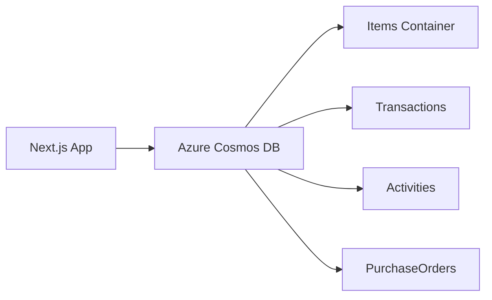
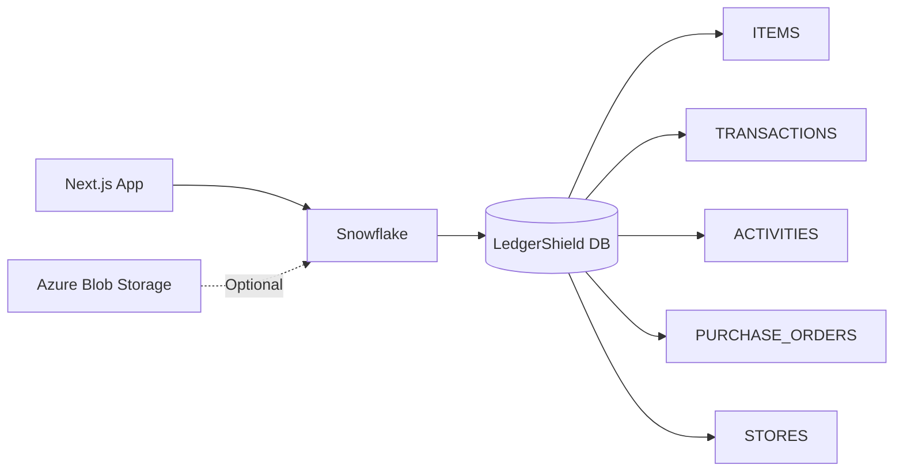
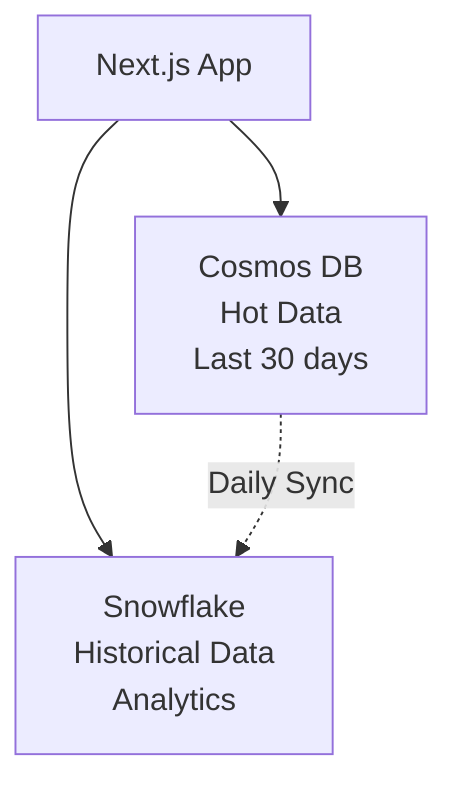

# 🚀 Snowflake Migration Guide for LedgerShield

**Complete Guide to Migrate from Azure Cosmos DB to Snowflake**

---

## 📋 Table of Contents

1. [Overview](#overview)
2. [Architecture](#architecture)
3. [Prerequisites](#prerequisites)
4. [Phase 1: Snowflake Account Setup](#phase-1-snowflake-account-setup)
5. [Phase 2: Database Schema Setup](#phase-2-database-schema-setup)
6. [Phase 3: Azure Integration](#phase-3-azure-integration)
7. [Phase 4: Application Code Changes](#phase-4-application-code-changes)
8. [Phase 5: Data Migration](#phase-5-data-migration)
9. [Phase 6: Testing](#phase-6-testing)
10. [Cost Comparison](#cost-comparison)
11. [Next Steps](#next-steps)

---

## Overview

### What We're Doing

Migrating **LedgerShield** from Azure Cosmos DB (NoSQL) to **Snowflake** (Cloud Data Warehouse) while keeping Azure infrastructure:

- ✅ **Keep**: Azure App Services, Azure Blob Storage, Azure Functions (if any)
- 🔄 **Migrate**: Database from Cosmos DB → Snowflake
- 📊 **Benefit**: Better analytics, SQL support, lower costs for warehousing

### Why Snowflake?

| Feature | Azure Cosmos DB | Snowflake |
|---------|----------------|-----------|
| **Type** | NoSQL (Document DB) | Relational (SQL) |
| **Best For** | Real-time transactional | Analytics & Reporting |
| **Query Language** | Limited SQL | Full SQL Support |
| **Scaling** | Manual RU management | Auto-scaling |
| **Cost** | Pay per RU/s | Pay per usage (storage + compute) |
| **Analytics** | Limited | Advanced (window functions, CTEs) |

---

## Architecture

### Current Setup (Before Migration)



### New Setup (After Migration)



### Hybrid Option (Recommended for Large Scale)



---

## Prerequisites

Before you begin, ensure you have:

- ✅ Azure account (existing)
- ✅ Current Cosmos DB credentials
- ✅ Admin access to LedgerShield codebase
- ⚠️ **New**: Snowflake trial/paid account (we'll create this)

---

## Phase 1: Snowflake Account Setup

### Step 1.1: Create Snowflake Account

> [!IMPORTANT]
> Choose the **same Azure region** as your application for low latency!

1. Go to [https://signup.snowflake.com](https://signup.snowflake.com)
2. Select **Azure** as cloud provider
3. Choose region (e.g., `East US`, `Central India`, `West Europe`)
4. Select edition:
   - **Standard** (recommended for testing)
   - **Enterprise** (for production with advanced features)
5. Sign up with your email

### Step 1.2: Initial Login

1. Check your email for Snowflake activation link
2. Set your password
3. Login to Snowflake Web UI: `https://<your-account>.snowflakecomputing.com`

### Step 1.3: Create a Worksheet

In Snowflake Web UI:
1. Click **Worksheets** (left sidebar)
2. Click **+ Worksheet** (top right)
3. This is where you'll run all SQL commands

---

## Phase 2: Database Schema Setup

### Step 2.1: Create Database and Schema

Run these commands in your Snowflake Worksheet:

```sql
-- Create Database (matching your current Cosmos DB name)
CREATE DATABASE INVENTORYDB;

-- Use the database
USE DATABASE INVENTORYDB;

-- Create Schema
CREATE SCHEMA SUPPLY_CHAIN;

-- Use the schema
USE SCHEMA SUPPLY_CHAIN;
```

### Step 2.2: Create Tables

#### 2.2.1 Items Table

```sql
CREATE OR REPLACE TABLE ITEMS (
    ID VARCHAR(50) PRIMARY KEY,
    NAME VARCHAR(255) NOT NULL,
    CATEGORY VARCHAR(100) NOT NULL,
    QUANTITY NUMBER(10,2) DEFAULT 0,
    PRICE NUMBER(12,2) NOT NULL,
    UNIT VARCHAR(50),
    STATUS VARCHAR(50) DEFAULT 'In Stock',
    OWNER_ID VARCHAR(100) NOT NULL,
    SECTION VARCHAR(50) NOT NULL, -- 'FDC', 'Hospital', or 'NGO'
    LAST_UPDATED TIMESTAMP_NTZ DEFAULT CURRENT_TIMESTAMP(),
    MIN_QUANTITY NUMBER(10,2),
    EXPIRY_DATE DATE,
    MANUFACTURING_DATE DATE,
    BATCH_NUMBER VARCHAR(100),
    SUPPLIER VARCHAR(255),
    DESCRIPTION TEXT
);
```

#### 2.2.2 Transactions Table

```sql
CREATE OR REPLACE TABLE TRANSACTIONS (
    ID VARCHAR(50) PRIMARY KEY,
    INVOICE_NUMBER VARCHAR(50) UNIQUE NOT NULL,
    DATE TIMESTAMP_NTZ NOT NULL,
    TYPE VARCHAR(50) NOT NULL, -- Valid values: 'SALE', 'INTERNAL_USAGE', 'DAMAGE', 'EXPIRY'
    ITEMS VARIANT, -- JSON array of transaction items
    TOTAL_AMOUNT NUMBER(12,2) NOT NULL,
    PAYMENT_METHOD VARCHAR(50),
    CUSTOMER_NAME VARCHAR(255),
    CUSTOMER_CONTACT VARCHAR(50),
    PERFORMED_BY VARCHAR(100) NOT NULL,
    SECTION VARCHAR(50) NOT NULL
);
```

#### 2.2.3 Activities Table

```sql
CREATE OR REPLACE TABLE ACTIVITIES (
    ID VARCHAR(50) PRIMARY KEY,
    USER VARCHAR(100) NOT NULL,
    ACTION VARCHAR(255) NOT NULL,
    TARGET VARCHAR(255) NOT NULL,
    TIME TIMESTAMP_NTZ DEFAULT CURRENT_TIMESTAMP(),
    TYPE VARCHAR(50) NOT NULL,
    SECTION VARCHAR(50) NOT NULL
);
```

#### 2.2.4 Purchase Orders Table

```sql
CREATE OR REPLACE TABLE PURCHASE_ORDERS (
    ID VARCHAR(50) PRIMARY KEY,
    PO_NUMBER VARCHAR(50) UNIQUE NOT NULL,
    DATE_CREATED TIMESTAMP_NTZ DEFAULT CURRENT_TIMESTAMP(),
    STATUS VARCHAR(50) DEFAULT 'PENDING',
    ITEMS VARIANT, -- JSON array
    VENDOR VARCHAR(255),
    TOTAL_ESTIMATED_COST NUMBER(12,2),
    CREATED_BY VARCHAR(100) NOT NULL,
    APPROVED_BY VARCHAR(100),
    RECEIVED_DATE TIMESTAMP_NTZ,
    NOTES TEXT
);
```

#### 2.2.5 Stores Table

```sql
CREATE OR REPLACE TABLE STORES (
    ID VARCHAR(50) PRIMARY KEY,
    NAME VARCHAR(255) UNIQUE NOT NULL,
    SECTION VARCHAR(50) NOT NULL,
    CONTAINER_NAME VARCHAR(255), -- For backward compatibility
    STATUS VARCHAR(50) DEFAULT 'ACTIVE',
    CREATED_AT TIMESTAMP_NTZ DEFAULT CURRENT_TIMESTAMP()
);
```

### Step 2.3: Create Indexes (Clustering Keys)

Snowflake uses **clustering keys** instead of traditional indexes:

```sql
-- Items clustering
ALTER TABLE ITEMS CLUSTER BY (SECTION, STATUS, CATEGORY);

-- Transactions clustering
ALTER TABLE TRANSACTIONS CLUSTER BY (SECTION, DATE);

-- Activities clustering
ALTER TABLE ACTIVITIES CLUSTER BY (SECTION, TIME);

-- Purchase Orders clustering
ALTER TABLE PURCHASE_ORDERS CLUSTER BY (STATUS, DATE_CREATED);

-- Stores clustering
ALTER TABLE STORES CLUSTER BY (SECTION, STATUS);
```

### Step 2.4: Create Views for Analytics

```sql
-- Low stock items view
CREATE OR REPLACE VIEW V_LOW_STOCK_ITEMS AS
SELECT 
    ID,
    NAME,
    CATEGORY,
    QUANTITY,
    MIN_QUANTITY,
    SECTION,
    OWNER_ID,
    LAST_UPDATED
FROM ITEMS
WHERE QUANTITY <= MIN_QUANTITY
  AND STATUS != 'Out of Stock';

-- Monthly sales summary
CREATE OR REPLACE VIEW V_MONTHLY_SALES AS
SELECT 
    DATE_TRUNC('MONTH', DATE) AS MONTH,
    SECTION,
    COUNT(*) AS TRANSACTION_COUNT,
    SUM(TOTAL_AMOUNT) AS TOTAL_REVENUE,
    AVG(TOTAL_AMOUNT) AS AVG_TRANSACTION_VALUE
FROM TRANSACTIONS
WHERE TYPE = 'SALE'
GROUP BY DATE_TRUNC('MONTH', DATE), SECTION;

-- Stock value by section
CREATE OR REPLACE VIEW V_STOCK_VALUE AS
SELECT 
    SECTION,
    CATEGORY,
    COUNT(*) AS ITEM_COUNT,
    SUM(QUANTITY * PRICE) AS TOTAL_VALUE
FROM ITEMS
GROUP BY SECTION, CATEGORY;
```

---

## Phase 3: Azure Integration

### Option A: Direct Connection (Recommended for Start)

Your Next.js app will connect directly to Snowflake using ODBC/Node.js driver.

**No additional Azure setup needed** - skip to Phase 4.

### Option B: Azure External Stage (For Large Data Loads)

If you want to load large CSV/JSON files from Azure Blob Storage:

#### Step 3.1: Create Azure Storage Container

```bash
# Using Azure CLI
az storage container create \
  --name ledgershield-data \
  --account-name <your-storage-account>
```

#### Step 3.2: Create Integration in Snowflake

```sql
-- Create storage integration
CREATE STORAGE INTEGRATION azure_ledgershield_integration
  TYPE = EXTERNAL_STAGE
  STORAGE_PROVIDER = AZURE
  ENABLED = TRUE
  AZURE_TENANT_ID = '<your-tenant-id>'
  STORAGE_ALLOWED_LOCATIONS = ('azure://<storage-account>.blob.core.windows.net/<container>/');

-- Describe to get consent URL
DESC STORAGE INTEGRATION azure_ledgershield_integration;
```

#### Step 3.3: Create External Stage

```sql
CREATE STAGE azure_stage
  STORAGE_INTEGRATION = azure_ledgershield_integration
  URL = 'azure://<storage-account>.blob.core.windows.net/<container>/'
  FILE_FORMAT = (TYPE = JSON);
```

---

## Phase 4: Application Code Changes

### Step 4.1: Install Snowflake Connector

```bash
cd d:\Sourabh\snowflake
npm install snowflake-sdk
```

### Step 4.2: Environment Variables

Add to `.env.local`:

```env
# Snowflake Configuration
SNOWFLAKE_ACCOUNT=<your-account>  # e.g., xy12345.east-us-2.azure
SNOWFLAKE_USERNAME=<your-username>
SNOWFLAKE_PASSWORD=<your-password>
SNOWFLAKE_WAREHOUSE=COMPUTE_WH
SNOWFLAKE_DATABASE=INVENTORYDB
SNOWFLAKE_SCHEMA=SUPPLY_CHAIN

# Keep Azure (optional fallback)
AZURE_COSMOS_ENDPOINT=<existing>
AZURE_COSMOS_KEY=<existing>
```

### Step 4.3: Create Snowflake Service

Create file: `lib/snowflakeService.ts`

```typescript
import snowflake from 'snowflake-sdk';

// Interfaces (same as Azure)
export interface StockItem {
    id: string;
    name: string;
    category: string;
    quantity: number;
    price: number;
    status: "In Stock" | "Low Stock" | "Out of Stock";
    lastUpdated: string;
    expiryDate?: string;
    manufacturingDate?: string;
    batchNumber?: string;
    supplier?: string;
    description?: string;
    unit?: string;
    minQuantity?: number;
    ownerId: string;
    section: string;
}

// ... other interfaces

export class SnowflakeInventoryService {
    private connection: snowflake.Connection;
    private isConnected: boolean = false;

    constructor() {
        this.connection = snowflake.createConnection({
            account: process.env.SNOWFLAKE_ACCOUNT!,
            username: process.env.SNOWFLAKE_USERNAME!,
            password: process.env.SNOWFLAKE_PASSWORD!,
            warehouse: process.env.SNOWFLAKE_WAREHOUSE!,
            database: process.env.SNOWFLAKE_DATABASE!,
            schema: process.env.SNOWFLAKE_SCHEMA!
        });

        this.connect();
    }

    private async connect() {
        return new Promise((resolve, reject) => {
            this.connection.connect((err, conn) => {
                if (err) {
                    console.error('Failed to connect to Snowflake', err);
                    reject(err);
                } else {
                    console.log('✅ Connected to Snowflake');
                    this.isConnected = true;
                    resolve(conn);
                }
            });
        });
    }

    private async executeQuery<T>(sqlText: string, binds?: any[]): Promise<T[]> {
        return new Promise((resolve, reject) => {
            this.connection.execute({
                sqlText,
                binds,
                complete: (err, stmt, rows) => {
                    if (err) {
                        console.error('Query failed:', err);
                        reject(err);
                    } else {
                        resolve(rows as T[]);
                    }
                }
            });
        });
    }

    // Get all items
    async getAllItems(section: string): Promise<StockItem[]> {
        if (!this.isConnected) return [];
        
        const query = 'SELECT * FROM ITEMS WHERE SECTION = ? ORDER BY LAST_UPDATED DESC';
        return this.executeQuery<StockItem>(query, [section]);
    }

    // Add item
    async addItem(item: Omit<StockItem, 'id' | 'lastUpdated'>): Promise<StockItem> {
        const id = Math.random().toString(36).substring(7);
        const now = new Date().toISOString();

        const query = `
            INSERT INTO ITEMS (
                ID, NAME, CATEGORY, QUANTITY, PRICE, UNIT, STATUS,
                OWNER_ID, SECTION, LAST_UPDATED, MIN_QUANTITY,
                EXPIRY_DATE, MANUFACTURING_DATE, BATCH_NUMBER,
                SUPPLIER, DESCRIPTION
            ) VALUES (?, ?, ?, ?, ?, ?, ?, ?, ?, ?, ?, ?, ?, ?, ?, ?)
        `;

        const binds = [
            id, item.name, item.category, item.quantity, item.price,
            item.unit || null, item.status, item.ownerId, item.section,
            now, item.minQuantity || null, item.expiryDate || null,
            item.manufacturingDate || null, item.batchNumber || null,
            item.supplier || null, item.description || null
        ];

        await this.executeQuery(query, binds);
        
        return { ...item, id, lastUpdated: now } as StockItem;
    }

    // Update item
    async updateItem(id: string, updates: Partial<StockItem>, section: string): Promise<StockItem | null> {
        const fields = Object.keys(updates).filter(k => k !== 'id');
        const setClause = fields.map(f => `${f.toUpperCase()} = ?`).join(', ');
        const binds = [...fields.map(f => (updates as any)[f]), new Date().toISOString(), id, section];

        const query = `
            UPDATE ITEMS 
            SET ${setClause}, LAST_UPDATED = ?
            WHERE ID = ? AND SECTION = ?
        `;

        await this.executeQuery(query, binds);
        
        // Fetch updated item
        const result = await this.executeQuery<StockItem>('SELECT * FROM ITEMS WHERE ID = ?', [id]);
        return result[0] || null;
    }

    // Delete item
    async deleteItem(id: string, section: string): Promise<boolean> {
        const query = 'DELETE FROM ITEMS WHERE ID = ? AND SECTION = ?';
        await this.executeQuery(query, [id, section]);
        return true;
    }

    // ... Implement other methods similarly
}

export const snowflakeService = new SnowflakeInventoryService();
```

### Step 4.4: Update API Routes

Modify `app/actions/*.ts` files to use Snowflake instead of Cosmos:

```typescript
// Before
import { azureService } from '@/lib/azureDefaults';

// After
import { snowflakeService } from '@/lib/snowflakeService';

// Update all method calls
const items = await snowflakeService.getAllItems(section);
```

---

## Phase 5: Data Migration

### Step 5.1: Export from Cosmos DB

Create script: `scripts/export-cosmos-data.ts`

```typescript
import { azureService } from '../lib/azureDefaults';
import * as fs from 'fs';

async function exportData() {
    console.log('📦 Exporting from Cosmos DB...');

    const items = await azureService.getGlobalItems();
    const transactions = await azureService.getAllTransactions();
    const activities = await azureService.getAllActivities();
    const orders = await azureService.getOrders();
    const stores = await azureService.getSystemStores();

    fs.writeFileSync('export/items.json', JSON.stringify(items, null, 2));
    fs.writeFileSync('export/transactions.json', JSON.stringify(transactions, null, 2));
    fs.writeFileSync('export/activities.json', JSON.stringify(activities, null, 2));
    fs.writeFileSync('export/orders.json', JSON.stringify(orders, null, 2));
    fs.writeFileSync('export/stores.json', JSON.stringify(stores, null, 2));

    console.log('✅ Export complete!');
}

exportData();
```

Run:
```bash
mkdir export
npx ts-node scripts/export-cosmos-data.ts
```

### Step 5.2: Load into Snowflake

#### Option A: Using Snowflake Web UI

1. Login to Snowflake Web UI
2. Go to **Databases** → **INVENTORYDB** → **SUPPLY_CHAIN** → **ITEMS**
3. Click **Load Data**
4. Upload `export/items.json`
5. Configure JSON parser
6. Repeat for other tables

#### Option B: Using SQL (Recommended)

```sql
-- Create file format
CREATE FILE FORMAT JSON_FORMAT
  TYPE = 'JSON'
  STRIP_OUTER_ARRAY = TRUE;

-- Create internal stage
CREATE STAGE DATA_STAGE;

-- Upload files using SnowSQL or Web UI
-- Then load:

COPY INTO ITEMS
FROM @DATA_STAGE/items.json
FILE_FORMAT = JSON_FORMAT
MATCH_BY_COLUMN_NAME = CASE_INSENSITIVE;

COPY INTO TRANSACTIONS
FROM @DATA_STAGE/transactions.json
FILE_FORMAT = JSON_FORMAT
MATCH_BY_COLUMN_NAME = CASE_INSENSITIVE;

-- Repeat for other tables
```

### Step 5.3: Validate Migration

```sql
-- Check row counts
SELECT 'ITEMS' AS TABLE_NAME, COUNT(*) AS ROW_COUNT FROM ITEMS
UNION ALL
SELECT 'TRANSACTIONS', COUNT(*) FROM TRANSACTIONS
UNION ALL
SELECT 'ACTIVITIES', COUNT(*) FROM ACTIVITIES
UNION ALL
SELECT 'PURCHASE_ORDERS', COUNT(*) FROM PURCHASE_ORDERS
UNION ALL
SELECT 'STORES', COUNT(*) FROM STORES;

-- Verify data integrity
SELECT SECTION, COUNT(*) AS ITEM_COUNT, SUM(QUANTITY) AS TOTAL_QTY
FROM ITEMS
GROUP BY SECTION;
```

---

## Phase 6: Testing

### 6.1 Unit Tests

Create `__tests__/snowflake.test.ts`:

```typescript
import { snowflakeService } from '../lib/snowflakeService';

describe('Snowflake Service', () => {
    test('Get all items', async () => {
        const items = await snowflakeService.getAllItems('Hospital');
        expect(Array.isArray(items)).toBe(true);
    });

    test('Add and delete item', async () => {
        const newItem = {
            name: 'Test Medicine',
            category: 'Medicine',
            quantity: 100,
            price: 50,
            status: 'In Stock' as const,
            ownerId: 'test-owner',
            section: 'Hospital'
        };

        const added = await snowflakeService.addItem(newItem);
        expect(added.id).toBeDefined();

        const deleted = await snowflakeService.deleteItem(added.id, 'Hospital');
        expect(deleted).toBe(true);
    });
});
```

### 6.2 Integration Tests

Test each feature:
- ✅ Login
- ✅ View inventory
- ✅ Add new item
- ✅ Update item
- ✅ Process transaction
- ✅ Create purchase order
- ✅ View analytics

### 6.3 Performance Testing

```sql
-- Test query performance
SELECT 
    QUERY_ID,
    QUERY_TEXT,
    EXECUTION_TIME,
    ROWS_PRODUCED
FROM TABLE(INFORMATION_SCHEMA.QUERY_HISTORY())
WHERE START_TIME > DATEADD('hour', -1, CURRENT_TIMESTAMP())
ORDER BY EXECUTION_TIME DESC
LIMIT 10;
```

---

## Cost Comparison

### Azure Cosmos DB (Current)

| Component | Monthly Cost |
|-----------|-------------|
| 400 RU/s provisioned | ~$23/month |
| Storage (1 GB) | ~$0.25/month |
| **Total** | **~$25/month** |

### Snowflake (New)

| Component | Monthly Cost |
|-----------|-------------|
| Compute (1 credit/day) | ~$2-4/month |
| Storage (1 GB) | ~$0.02/month |
| **Total** | **~$5/month** |

> [!TIP]
> Snowflake is **~80% cheaper** for analytics workloads!

---

## Next Steps

### Immediate Actions

1. ✅ Review this guide
2. ⚠️ Create Snowflake trial account
3. ⚠️ Run Phase 2 SQL scripts (create tables)
4. ⚠️ Approve implementation plan (to be created)

### Post-Migration

1. **Monitor Performance**: Use Snowflake Query History
2. **Optimize Clustering**: Adjust clustering keys based on query patterns
3. **Set up Alerts**: Create monitors for low stock, expired items
4. **Advanced Analytics**: Use Snowflake's ML functions

### Optional Enhancements

- **Snowpipe**: Auto-load data from Azure Blob Storage
- **Streams & Tasks**: Real-time data processing
- **Data Sharing**: Share analytics with partners
- **Time Travel**: Query historical data (up to 90 days)

---

## 🆘 Troubleshooting

### Connection Issues

```typescript
// Test connection
import snowflake from 'snowflake-sdk';

const connection = snowflake.createConnection({
    account: process.env.SNOWFLAKE_ACCOUNT!,
    username: process.env.SNOWFLAKE_USERNAME!,
    password: process.env.SNOWFLAKE_PASSWORD!
});

connection.connect((err, conn) => {
    if (err) {
        console.error('Connection failed', err);
    } else {
        console.log('✅ Successfully connected!');
    }
});
```

### Query Errors

Check Snowflake Web UI → **History** → View error details

### Performance Issues

```sql
-- Enable query profiling
ALTER SESSION SET USE_CACHED_RESULT = FALSE;

-- View execution plan
EXPLAIN SELECT * FROM ITEMS WHERE SECTION = 'Hospital';
```

---

## 📚 Resources

- [Snowflake Documentation](https://docs.snowflake.com)
- [Snowflake Node.js Driver](https://docs.snowflake.com/en/user-guide/nodejs-driver)
- [Azure + Snowflake Guide](https://docs.snowflake.com/en/user-guide/data-load-azure)
- [SQL Reference](https://docs.snowflake.com/en/sql-reference)

---

**Ready to migrate? Let's get started! 🚀**
